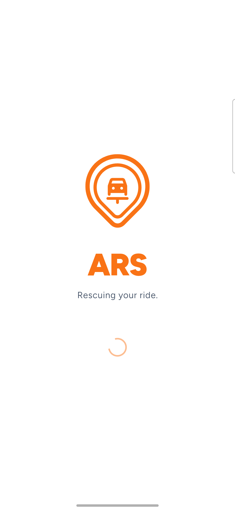
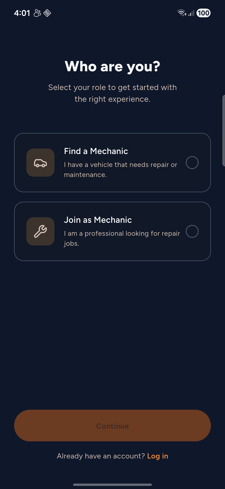

<div align="center">
  

  <h1>ARS — Auto Repair Service</h1>

  <p><em>Rescuing your ride.</em></p>

  <p>On-demand auto repair, on a map. ARS connects vehicle owners with nearby mechanics for booking, live ETA, in-app chat, payments, and AI-assisted diagnostics — with a real-time dashboard for mechanics.</p>

  <p>
    
    
    
    
    
    
  </p>
  <p>
    
    
  </p>
</div>

---

## 📱 Screenshots

<div align="center">
  
  &nbsp;&nbsp;
  
</div>

<div align="center"><sub>Splash · Choose your role (customer or mechanic)</sub></div>

> More screens (booking map, live ETA, chat, mechanic dashboard) require a live Firebase project — see [Getting Started](#-getting-started).

## 📖 About

**ARS (Auto Repair Service)** is a Flutter mobile app that connects vehicle owners with professional mechanics for on-demand automotive repair. A customer can describe a problem, get an AI-assisted diagnosis and cost estimate, find a nearby mechanic on a live map, watch their ETA, chat in real time, and pay — while mechanics manage incoming jobs from a real-time dashboard.

It's built **Android-first** with a **feature-first clean architecture**, Firebase for backend services, and a **self-hosted OSRM** routing engine for accurate, zero-cost ETAs tuned for Metro Manila.

## ✨ Key Features

- 🤖 **AI Diagnostic Chatbot** — 87.4% accurate automotive diagnosis with Taglish support (201 terms, 97.5% accuracy)
- 💰 **Smart Cost Estimation** — Metro Manila pricing with urgency classification
- 🗺️ **Real-time Location Services** — find nearby mechanics and track requests on a live map
- 🧭 **Live ETA** — self-hosted OSRM routing with 30-second auto-refresh
- 👤 **Auth & Roles** — separate customer and mechanic flows (Firebase Auth)
- 🚙 **Vehicle Management** — add and manage multiple vehicles
- 🔧 **Service Booking** — engine, brake, tire, battery, oil change, AC, and more
- 💬 **In-app Chat** — real-time messaging between customer and mechanic
- 📊 **Service Tracking** — monitor a job from request to completion
- 🏪 **Mechanic Dashboard** — real-time map of nearby requests, online/offline toggle, earnings
- 🔔 **Push Notifications** — Firebase Cloud Messaging + local notifications

## 🛠️ Tech Stack

- **Framework:** Flutter 3.9+ · **Language:** Dart 3.9+
- **Architecture:** Feature-first clean architecture (`data` / `domain` / `presentation`)
- **State management:** [Riverpod](https://riverpod.dev) — provider infrastructure in place; feature-by-feature migration from `StatefulWidget` in progress (mechanic *earnings* migrated as the reference slice, with unit tests)
- **Design system:** ARS token-based theme (orange `#F97316`, light + dark) with widget/token tests
- **Backend (Firebase):** Auth, Cloud Firestore, Cloud Storage, Cloud Messaging, Crashlytics
- **Maps & location:** `flutter_map` (OpenStreetMap tiles), `google_maps_flutter`, `geolocator`
- **Routing/ETA:** **self-hosted OSRM** (custom server, no external routing cost)
- **AI / ML (companion service — see below):** ARS Rapide diagnostic API (FastAPI + Gemini 2.0 Flash, LangGraph, ChromaDB/RAG, Redis cache)
- **Testing:** `flutter_test` — design-system, architecture, and feature (Riverpod notifier) tests
- **Tooling:** `flutter_launcher_icons`, `flutter_lints`

## 🏗️ Architecture

ARS organizes code by **feature**, each split into clean-architecture layers. Customer screens are prefixed `user_*`; mechanic screens `mechanic_*`.

```
lib/
├── core/                     # Shared: auth, theme/design-system, services
│   ├── providers/            # Riverpod core providers (Firebase, OSRM, auth, repos)
│   ├── theme/                # ARS design system (tokens, light/dark themes)
│   ├── services/             # Notifications, OSRM routing, location sharing
│   ├── widgets/ utils/ models/ constants/
├── features/
│   ├── onboarding/           # Splash, onboarding, role selection
│   ├── customer/             # user_* — auth, booking, vehicles, dashboard, ...
│   │   └── booking/{data,domain,presentation}/
│   └── mechanic/             # mechanic_* — auth, dashboard, services, earnings
│       └── earnings/presentation/providers/   # ← Riverpod migration template
├── firebase_options.dart     # gitignored — generated via `flutterfire configure`
└── main.dart                 # Entry point (ProviderScope + Firebase init)
```

**Principles:** feature isolation, clear `data`/`domain`/`presentation` boundaries, shared code in `core/`, single responsibility per module. See [`docs/ARCHITECTURE.md`](docs/ARCHITECTURE.md).

## 🚀 Getting Started

### Prerequisites
- [Flutter SDK](https://docs.flutter.dev/get-started/install) 3.9+ and Dart 3.9+
- Android Studio or VS Code, and an Android device/emulator

### Setup

```bash
# 1. Clone
git clone https://github.com/KpG782/ars.git
cd ars

# 2. Install dependencies
flutter pub get
```

**3. Firebase (bring your own project).** This repo does **not** ship Firebase config — `lib/firebase_options.dart` and `android/app/google-services.json` are gitignored. Generate your own:

```bash
dart pub global activate flutterfire_cli
flutterfire configure          # creates firebase_options.dart + google-services.json
```

> The app is wrapped so it still launches without a valid Firebase project (UI works), but auth, Firestore, and push require your own project.

**4. (Optional) AI chatbot key.** Copy `.env.example` to `.env` and set your key; without it, the AI diagnostic chat is simply disabled:

```bash
cp .env.example .env       # then set ARS_CHATBOT_API_KEY=...
```

**5. (Optional) Google Maps key** — set it in `android/app/src/main/AndroidManifest.xml` (`com.google.android.geo.API_KEY`) if you use Google Maps tiles; OpenStreetMap tiles work without one.

**6. Run**

```bash
flutter run
```

### Handy commands
```bash
flutter analyze        # static analysis (currently clean)
flutter test           # run the test suite
flutter build apk --debug
```

## 🤖 AI & API Integrations

The diagnostic intelligence runs in **ARS Rapide**, a separate FastAPI service this app integrates with over HTTP (`X-API-Key`).

- **ARS Rapide Diagnostic API** — RAG-based automotive diagnosis, Taglish support, cost estimation
  - Accuracy: **87.4%** diagnostic accuracy · Taglish **97.5%** (201 terms)
  - Response time: ~3.7s (cache miss) / <1s (cache hit, Redis)
  - Stack: Gemini 2.0 Flash · LangGraph (agentic state machine) · ChromaDB (vector search) · Redis · Prometheus metrics
- **Firebase:** Auth (email/password), Cloud Firestore (real-time), Cloud Storage (docs/photos), FCM (push)
- **Maps/Location:** OpenStreetMap tiles, Google Maps, Geolocator
- **OSRM (self-hosted):** real-time route + ETA between customer and mechanic, 30s auto-refresh, fallback estimation, Manila road network optimized, **no external API cost**

> Firestore access is enforced by [`firestore.rules`](firestore.rules) with composite indexes in [`firestore.indexes.json`](firestore.indexes.json); see [`docs/FIREBASE_SCHEMA_REVIEW.md`](docs/FIREBASE_SCHEMA_REVIEW.md).

## 🗺️ Roadmap

**Done**
- [x] Feature-first clean architecture
- [x] Customer + mechanic auth and onboarding
- [x] Service booking with live map
- [x] Self-hosted OSRM ETA (30s refresh, fallback)
- [x] In-app chat + push notifications
- [x] AI diagnostic chatbot integration (Taglish, cost estimation)
- [x] ARS design system (light/dark) + tests
- [x] Riverpod infrastructure + first feature migrated (earnings)
- [x] Firestore security rules + composite indexes

**Planned**
- [ ] Payment integration (GCash / cards)
- [ ] Reviews & ratings
- [ ] Complete the Riverpod migration across remaining features
- [ ] Advanced filters, full Tagalog/English localization, offline mode

## 👤 Author

**Ken Patrick Garcia** — [@KpG782](https://github.com/KpG782)

> ⚠️ Actively-developed portfolio project. Firebase config and secrets are intentionally **not** committed — run `flutterfire configure` and add your own `.env` to enable backend features.

## 📄 License

Released under the [MIT License](LICENSE).

---

<div align="center"><sub>Built with Flutter 💙</sub></div>
